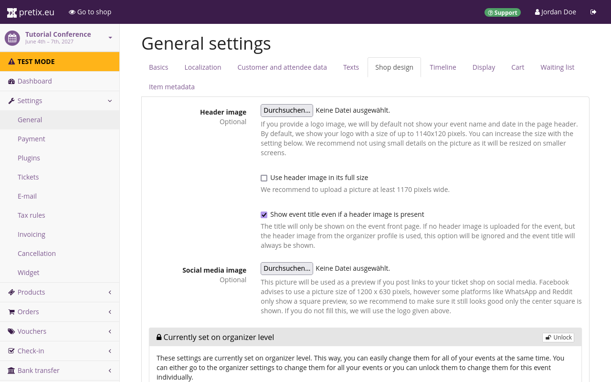

# Event 

After setting up an organizer account, the next step is creating an event. 
This article describes the creation and basic setup of an event. 
In this article, we will: 

 - create an event in four steps 
 - get an overview of the event's status on the dashboard
 - enable the collection of customer and attendee data 
 - add texts to the ticket shop 
 - customize the design of the ticket shop 
 - set up tax rules 

This includes all the necessary steps for creating an event and setting up the ticket shop so that we can add products to it in the next article of this tutorial. 

## Event creation 

In order to create an event, we must be logged in to our [pretix](https://pretix.eu/control/) account. 
Clicking the :btn:pretix.eu: button in the top left corner of the website takes us to the dashboard and an overview of our upcoming events. 
We will now click the :btn:⊕ Create a new event: button. 

 

An event in pretix is always associated with an organizer account, so we have to choose one here. 
We will choose the organizer that is hosting this event—that is, the one we just set up in the previous step of this tutorial. 
This selection cannot be changed after the event has been created, so it is important to pick the correct organizer account here. 

Next, we have to choose the event type. 
There are two options: "Singular event or non-event shop" and "Event series or time slot booking". 
For this tutorial, we want to create a simple conference that takes place on a single weekend, so we are going to choose the option "Singular event or non-event shop". 

After that, we are going to choose which languages to use for the event. 
By default, the languages chosen while setting up the organizer account should already be checked here. 
We will simply activate and deactivate the languages as needed.



 

After clicking :btn:Continue:, we are now asked to provide a name and a short form for the event. 
Our example conference is going to take place in 2027, therefore we choose "Example Conference" for the "event name" field, and "ex-conf" for the "short form" field. 
The short form is appended to the organizer's URL. 
This results in the following URL: [https://pretix.eu/ex-org/ex-conf](https://pretix.eu/ex-org/ex-conf). 



The start time and the currency for our event are mandatory information. 
We're going to put the fourth of June, 2027, into the start time field and we're going to choose the Euro in the currency drop-down menu. 

Since we already know the location for our event, we're going to put that location into pretix now. 
This is an optional step. 
The location can still be changed later. 
Our input into the "location" field will be used to search OpenStreetMap for that location. 
If the location can be found, the "geo coordinates" fields will be filled out automatically and the map preview will center on that location. 
If no results can be found for the input, the marker on the map can be dragged to the event location manually. 
This will automatically update the "geo coordinates" fields. 
Alternatively, we can use the more advanced search function on [OpenStreetMap.org](https://www.openstreetmap.org) and copy the address over to the "location" field. 

This page also allows us to set a sales tax rate for our event. 
This is an optional step. 
Taxation rules can also be changed after event creation is finished. 
We are holding our event in Germany and a single-percentage rule applies to all of our products. 
Thus, we are going to add a 19% tax rule here. 



 

We are then asked if we want to copy information from a previously created event. 
This step can save us a lot of work from our second event onwards. 
But since this is the first event we're organizing using pretix, we will simply leave the default (_"Do not copy"_) and click :btn:Continue: 

 

The next page congratulates us on creating our event. 
It also gives us a quick overview for products and basic settings for the event. 
We will take a closer look at products (tickets, gift cards, etc.) in the next section of this tutorial. 

We will fill out the contact address and imprint URL in the "getting in touch with you" section near the bottom of the page. 
We will provide a general email address at which our customers can contact us in the "contact address" field. 
We will provide a URL to legal imprint information for our organization in the "imprint URL" field. 
These two pieces of information are mandatory for our ticket shop to go live. 

Once we click :btn:Save: at the bottom of the page, we are taken to an overview of the event, which gives us its name, the timeline of tickets sales and presale, and the status of our ticket shop (most likely in test mode by this point). 

## Dashboard

Now that we have created our event, we have access to all possible options for the event. 
We can visit the dashboard for our event by clicking the :btn:pretix.eu: button in the top left and then selecting the event we just created in the list titled "your upcoming events". 
The dashboard for our event gives us an overview of the event's basic information and status. 
It allows us to leave an internal comment for ourselves and our team and it logs recent changes. 

 

This overview will probably display a warning that your organizer account is not yet active. 
If you see that warning, click the link and fill out the necessary information in the form. 
Activating an account is a manual process and may take some time depending on the availability of our team. 

## Customer and attendee data 

We need to issue certificates of participation to our attendees. 
That means we have to record their name and affiliation during purchase. 
This section describes how to do that. 
We are going to navigate to [Your Event] → "Settings" → "General" and open the "customer and attendee data" tab. 
Here, under the "attendee data (once per personalized ticket)" subheading, there are options for asking for attendee names, addresses per ticket, and company per ticket. 
We will set those three questions to "ask, but do not require input". 
By not making the input mandatory, it is still possible for attendees to not give you their data if they do not require a certificate of participation. 
In the text fields labeled "attendee data explanation", we will add an explanation as to why we're collecting the data in question. 
Our explanation reads as follows: 
"We are asking you to submit the name, email address and company for every attendee that you're buying a ticket for. This data is necessary for issuing certificates of participation."

Under "form settings", we can choose the format in which pretix will ask attendees for names and titles. 
The default option for names is "ask for given name, + family name, display like John Doe". 
The default option for titles is "free text input". 
We are happy with those two options, so we are not going to make any changes here. 
It is recommended to finalize the choice here before taking the ticket shop live. 
Changing this after already having received orders can lead to issues when sorting or changing names. 

## Shop design 

 

Switching to the "shop design" tab at the top allows us to add content to our event shop. 
You can see what the shop looks like from the customer's perspective if you click the :btn:👁 Go to shop: button in the bar at the top. 
The demo we are creating for this tutorial is located at https://pretix.eu/ex-org/ex-conf/. 
Replacing "ex-org" with the short form of your organizer and "ex-conf" with the short form of your event in that URL will take you to your shop. 

By default, the name of the event will be displayed in the page header of our shop. 
The shop design settings allow us to replace the name with a header image that tells our customers about the event (e.g., by means of the event name, logo, or recognizable design). 
It should be a .png or .jpg file with a resolution of 1140 × 120 pixels or slightly smaller. 
You can add the header image by clicking the :btn:Browse...: button next to the "Header image" option and choosing the image file to upload from your computer. 
The header image will replace the name of the event at the top of the page unless you check the box next to "show event title even if a header image is present". 
You have the option to use the image in its full size, in which case it should be at least 1170 pixels in width. 

The "social media image" option lets you upload a .png  or .jpg file that will be used as a preview if you post links to your ticket shop on social media. 
If you do not upload a file here, the header image will be used for previews instead. 

!!! Warning

    Unlocking the color and font settings is not reversible. 
Only click the :btn:🔓 Unlock: button if you are absolutely positive that your event shop should have different color and font settings than your organizer's public profile. 
Once the settings have been unlocked, they have to be adjusted independently for this event. 

By default, the section with color and font settings is locked and you can only change them on the on organizer level. 
This way, you can easily change them for all of your events at the same time. 
You can either go to the organizer settings to change them for all your events or you can unlock them to change them for this event individually. 
If you wish to make individual adjustments to the shop design of the event, click the :btn:🔓 Unlock: button. 
This will allow you to adjust colors and fonts for the event shop independently of any settings you choose for the public profile on the organizer level. 

We recommend that you leave the settings here locked since that makes it easier to keep the shop designs consistent. 
If you want to change the design globally, click the :btn:Go to organizer settings: button and make your adjustments there. 

## Tax rules 

Navigate to [Your event] → "Settings" → "Tax rules". 
Click the :btn:+ Create a new tax rule: button. 
The "official name" fields are already filled out with "VAT" (English), "MwSt." (German) and, if  available, the appropriate translations in any languages you have selected. 
Choose an internal name if needed. 
This will only be used for the backend and helps you distinguish tax rules if you use more than one. 
Set the tax rate to the appropriate level, e.g. 19% for Germany and click the :btn:Save: button. 
