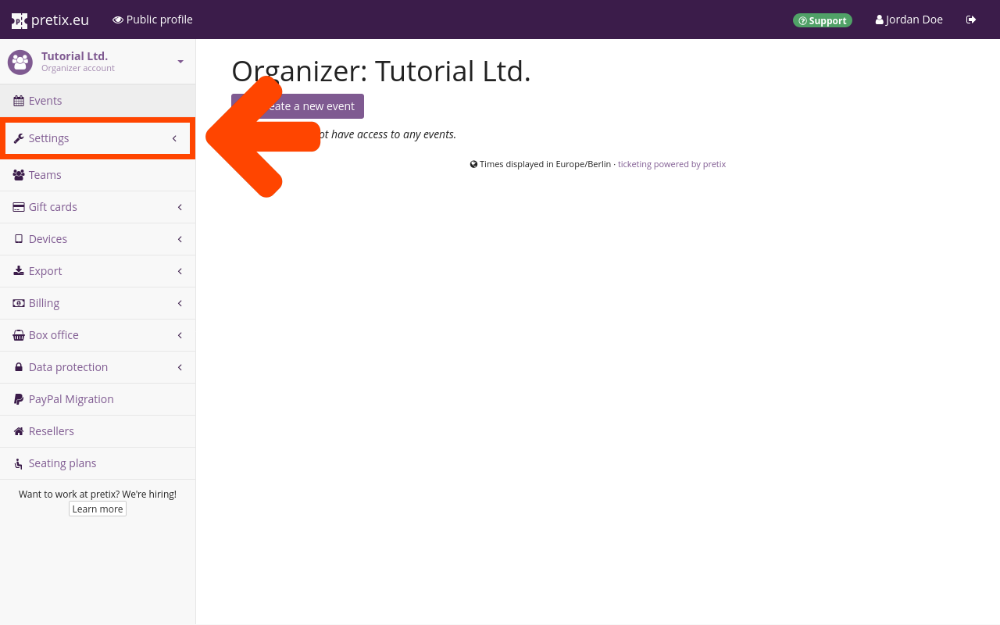

# Organizer account

An organizer account represents an entity that is running events, for example a company, an institution, or a person. 
We just created an organizer account and our personal account at the same time. 
It is also possible to gain (partial) access to an organizer account by being invited to pretix by a team member and accepting that invitation. 

In this section of the tutorial, we will customize our organizer account and add necessary information to it. 
We are going to take the following steps: 

 - adding contact information on the "general" tab
 - choosing language and localization options on the "localization" tab 
 - customizing the organizer page on the "organizer page" and "shop design" tabs
 - setting up cookie/privacy information on the "privacy" tab 
 - getting our pretix account activated by providing necessary information in the "billing settings"

These are the necessary steps for preparing our organizer account for hosting events with pretix. 
A few of these steps are optional, but will save us some work in the long term. 
For instance, organizer-level language and design settings will be used as the default for any events we are going to create in the future. 
We can always come back to adjust the organizer account settings later, in case our needs change. 

## Navigating to the organizer account settings 

After finishing account creation and logging in to [pretix.eu/control](https://pretix.eu/control/), we are greeted by the dashboard. 
We can always come back to this page by clicking the :btn:pretix.eu: button in the bar at the top. 
Clicking the :btn:Organizers: button in the sidebar takes us to the "Organizers" page.

 

Upon clicking our organizer account in the list, we are taken to a page displaying all events associated with that organizer.

 

We are now going to click :btn:Settings: in the sidebar, which lands us on the general settings page for the organizer account. 

## General 

 

The fields for "name" and "short form" are already filled out. 
It is not possible to change the short form because it is the organizer's unique identifier. 

Since we are operating from Germany and thus required by law to include certain legal information on all our websites, we are going to enter the URL to our website's imprint in the "Imprint URL" field.

!!! Note

    Even if you are not operating in Germany, we require all pretix Hosted customers to enter a valid imprint URL that points to information on who is reponsible for the published ticket shop.

We will enter a valid email address into the "contact address" field. 
This email address will be displayed under the label "Contact event organizer" in the footer of the public profile to allow customers to contact us. 

Clicking the :btn:Save: button at the bottom of the page confirms our changes.

## Localization 

 

After saving the general settings, we are going to switch to the "localization" tab. 

Under "available languages", we can choose which languages our ticket shop will be published in. 
The options officially maintained by the pretix team are "English", "German", and "German (informal)". 
"German" uses "Sie" to address the user whereas "German (informal)" uses "du". 
We can also choose one of the community translations for our organizer page. 
They are displayed in the list below along with a percentage indicating how much of the software is translated. 
English is used as the fallback language for missing translations. 
These settings also determine the default languages when creating new events, though languages can be activated or deactivated for each event individually.
We are going to activate "English" and "German (informal)" for our example conference. 



We are going to choose Germany from the drop-down "region" menu. 
The selection will be used to determine default formats for dates, times, addresses and phone numbers. 
We will choose "Europe/Berlin" as the "default timezone" from the drop-down menu with that title. 

We use the :btn:Save: button to apply our localization settings __before__ changing any settings on the other tabs because the localization settings determine which customizations are available there. 

## Organizer page 

 

Switching to the "organizer page" tab at the top allows us to add our logo and customize our shop's interface colors.
Clicking the :btn:👁 Public profile: button in the bar at the top takes us to a preview of the organizer page from the customers' perspective.
An organizer page created with pretix Hosted will always be located at [https://pretix.eu/[OrganizerShortForm]/](https://pretix.eu/[OrganizerShortForm]/).
The page we are creating for this tutorial is located at [https://pretix.eu/ex-org/](https://pretix.eu/ex-org).

By default, the name of the organizer will be displayed in the page header of our page.
The organizer page settings allow us to replace the name with a header image that tells our customers who is hosting the event (e.g., by means of our company name, logo, or recognizable design). 
We are going to add the header image by clicking the :btn:Browse...: button next to the "Header image" option and choosing a .png file with a resolution of 1140 × 120 pixels from our computer. 
The header image will replace the name of the event at the top of the page.
We are going to check the box next to "Use header image also for events without an individually uploaded logo". 

 

In the "homepage text" fields, we can provide text to be displayed on our public profile. 
There is one field for each language we activated in the "localization" tab (see the "localization" segment of this article)—English and German (informal). 
Our public profile will allow the viewer to switch between those languages via the links in the top right corner. 

## Privacy 

 

On the "privacy" tab, we can provide an URL pointing to our privacy policy for each language we activated. 

!!! Warning 

    It is ultimately your responsibility to ensure compliance with applicable legislation.
    We try to help by suggesting these settings, but we cannot assume liability since we do not know the exact configuration of your pretix usage, the legal details in your specific jurisdiction, or the agreements you have with third parties such as payment or tracking providers.

## Activation

<!-- md:hosted -->

Our organizer account has to be activated before any of our ticket shops can go live. 
Our account is going to be reviewed manually by the pretix team as soon as we have provided all necessary information for correspondence and billing.

To enter this information, we are going to navigate to [Organizer] → "Settings" → "Billing settings". 
The topmost field on the "general" tab is labeled "primary contact person". 
We are going to enter the name of a real person within our organization so the pretix team knows whom to contact if there is an issue with our account. 
We will enter their email address and phone number in the fields below.
This information is mandatory. 
Merely providing a company name is not enough to get our account activated. 

We are going to enter the full contact details of our company further down on the page. 
The VAT ID is not mandatory unless we are in a EU country other than Germany and want to make use of the reverse charge policy for our fees.

The pretix team offers service in English and German. 
We are going to choose English as our preferred language of correspondence. 

We are going to choose credit card as our preferred method of payment. 
We need to fill out our credit card info, check the box to authorize payments, and click the :btn:Save: button. 

The page will notify us if any required information is still missing. 
If we have provided all required information, a green checkmark will appear at the top of the page with the message "Your changes have been saved." 
This means that our organizer account has been submitted to the pretix team for review and will be activated shortly.

## Conclusion

Now that our account's basic setup is complete and it is awaiting activation, we can move on to creating our first event. 
