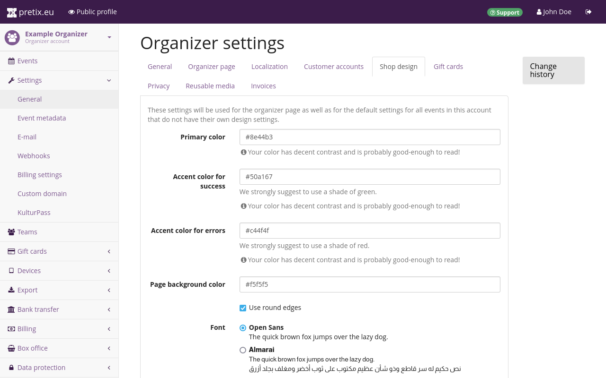
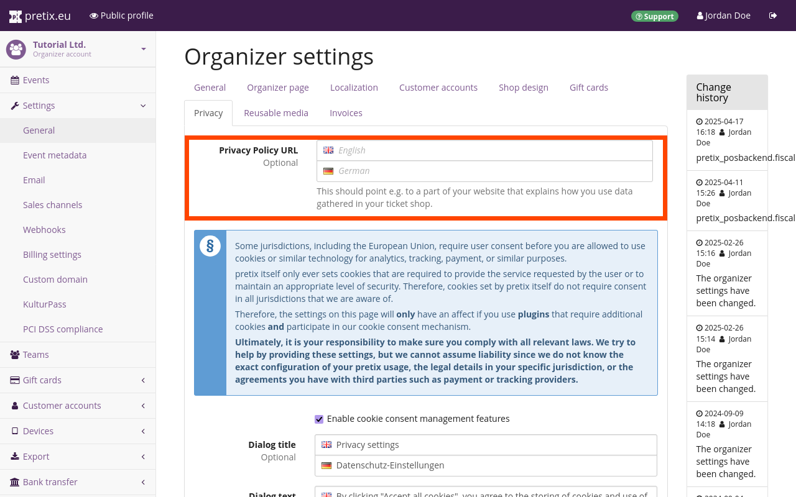

# Organizer account

An organizer account represents an entity that is running events, for example a company, an institution, or yourself. 
You have already created an organizer account when you created your personal account—or, if you were invited to pretix by a member of your team, then accepting that invitation has already given you (partial) access to an organizer account. 

This section of the tutorial tells you how to customize your organizer account and add necessary information to it. 
It will tell you how to: 

 - navigate to the organizer account settings 
 - add contact information on the "general" tab
 - choose language and localization options on the "localization" tab 
 - customize your organizer page on the "organizer page" and "shop design" tabs
 - enable customer accounts for certain features on the "customer accounts" tab
 - set up cookie/privacy information on the "privacy" tab 
 - get your pretix account activated by providing necessary information in the "Billing settings"

This includes all the necessary steps for getting your organizer account up and running so that you can use it to host events using pretix. 
It also includes a few optional steps that will save you some work in the long run. 
For instance, organizer-level language and design settings will be used as the default for any events you create in the future. 
You can always come back to the organizer account settings later and adapt them, should your needs change. 

## Navigating to the organizer account settings 

After finishing account creation and logging in to [pretix.eu/control](https://pretix.eu/control/), you are greeted by the dashboard. 
Click the :btn:Organizers: button in the sidebar to get to the Organizers page. 

 

Clicking your organizer account in the list takes you to a page displaying all events associated with that organizer. 

 

Click :btn:Settings: in the sidebar to set up your organizer account. 
This lands you on the general settings page for the organizer account. 

## General 

 

The fields for "Name" and "Short form" are already filled out. 
It is not possible to change the short form since it is the organizer's unique identifier. 

If you are operating from Germany, it is recommended that you enter the URL to your website's imprint in the "Imprint URL" field. 

Enter a valid email address into the "contact address" field. 
This email address will be displayed publicly to allow your customers to contact you. 

Confirm your changes by clicking the :btn:Save: button on the bottom of the page. 

## Localization 

 

After saving the general settings, switch to the "Localization" tab. 
We recommend changing localization settings __before__ changing any settings on the "Organizer page" tab because the localization settings determine which customizations are available there. 

Under "Available languages", you can choose which languages your ticket shop will be published in. 
The options officially maintained by the pretix team are English, German, and German (informal). 
German uses "Sie" to address the user whereas German (informal) uses "Du". 
You can also choose one of the community translations for your organizer page. 
They are displayed in the list below along with a percentage of how much of the software is translated. 
English is used as the fallback language for missing translations. 

This setting also determines the default languages when creating new events, though languages can be activated or deactivated for each event individually.



Choose a country or region from  the drop-down "Region" menu. 
The selection will be used to determine default date, time, address and phone number formatting. 
The language chosen above will take a higher priority than the region. 

Also choose a "Default timezone" from the drop-down menu with that title. 

## Organizer page 

 

Switching to the "Organizer page" tab at the top allows you to add content to the public profile of your organizer. 
You can take a look at the public profile by clicking the :btn:👁 Public profile: button in the bar at the top. 
Our public profile is located at https://pretix.eu/ex-org/. 
You can find yours by replacing "ex-org" with your organizer short form in that URL. 

 

By default, the name of the organizer  will be displayed in the page header of your public profile. 
The organizer page settings allow you to replace the name with an image that tells your customers who is hosting the event (e.g., by means of your company name, logo, or recognizable design). 
It should be a .png or .jpg file with a resolution of 1140 × 120 pixels or smaller. 
You can add the header image by clicking the :btn:Browse...: button next to the "Header image" option and choosing the image file to upload from your computer. 

In the "homepage text" fields, you can provide text to be displayed on your public profile. 
You will have one field for each language you activate in the "Localization" tab (see the "Localization" segment of this article). 
If you have more than one language enabled, your public profile will allow the viewer to switch between those languages via the links in the top right corner. 

You can choose the "Default overview style" for events on your public profile from the drop-down menu. 
Events will either be displayed in a list, a weekly overview, or a monthly overview. 
The list overview style is only available if your event series has 50 or less dates in the future. 

## Shop design 

 

Switch to the "Shop design" tab. 
Here, you can customize the colors and font used for your public profile and the ticket shops you are going to create. 
You can change the colors so that they're in line with the palette you use for your other media. 
Please heed the notice underneath the input fields and pick a different color if contrast is too low. 

You can also choose your preferred font from the list. 
If you're creating a ticket shop in a language that doesn't use the Latin alphabet, you should choose a font that supports the writing system you need. 
All available fonts support the Latin alphabet. 
The preview should give you an idea which writing systems each font supports. 
So for example, if you're creating a ticket shop in a language that uses the Cyrillic alphabet, you should pick a font such as DejaVu Sans or Noto Sans. 

The shop design you set here will be the default for all shops you create for your events in the future. 
You can make individual adjustments to the event shops. 

## Privacy 

 

On the "Privacy" tab, please provide an URL pointing to your privacy policy for each language you activated. 
The default dialog text and button labels for the cookie consent banner should already be filled out. 
Feel free to edit or replace these as you see fit. 

pretix itself only ever sets cookies that are required to provide the service requested by the user or to maintain an appropriate level of security. 
Therefore, cookies set by pretix itself do not require consent in all jurisdictions that we are aware of. 
The settings on the "Privacy" tab will only have an effect if you use plugins that require additional cookies and participate in our cookie consent mechanism.

Ultimately, it is your responsibility to make sure you comply with all relevant laws. 
We try to help by providing these settings, but we cannot assume liability since we do not know the exact configuration of your pretix usage, the legal details in your specific jurisdiction, or the agreements you have with third parties such as payment or tracking providers.

## Activation

Before any of your ticket shops can go live, your organizer account has to be activated. 
Your account is reviewed manually by our team as soon as you have provided all necessary information for correspondence and billing.

Navigate to [Your Organizer]→"Settings"→"Billing settings". 
The topmost field on the "general" tab is labeled "primary contact person". 
Enter the name of a real person (e.g. you or a coworker) we can contact if there is an issue with your account. 
Enter their email address and phone number in the fields below.

Enter the full contact details of your company further down on the page. 
If your company is located in the EU but outside of Germany, we recommend entering a VAT ID. 
If you do not provide your VAT ID here, we will need to charge you VAT on our services and we will not be able to issue reverse charge invoices. 
Again, this only applies if your company is located in the EU but outside of Germany. 

You can choose a preferred language of correspondence. 
We offer service in English and German.

Choose your preferred method of payment. 
You may pay by SEPA direct debit, by invoice, or by credit card. 
If you want to pay by SEPA direct debit, fill out your bank details in the form below and approve the mandate. 
If you want to pay by credit card, fill out your credit card information and authorize credit card payments to rami.io GmbH. 
If you are planning on only offering free tickets, you don't have to provide any further information here.

Once you are happy with your choices, click the :btn:Save: button. 
The page will notify you if any required information is still missing. 
If you have provided all required information, a green checkmark will appear at the top of the page with the message "Your changes have been saved." This means that your organizer account has been submitted to our team for review and will be activated shortly.

The "billing contact" and "privacy contact" tabs allow you to provide different contacts within your organization for billing and privacy matters. 
This is completely optional. 
You only need to fill out the information on the "general" tab of the billing settings to get your account approved. 