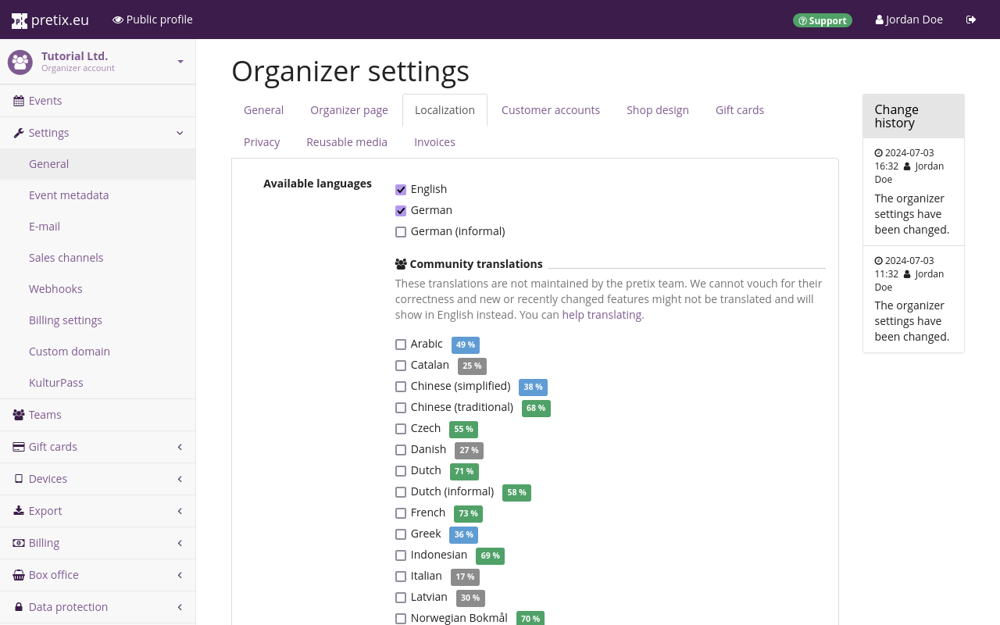
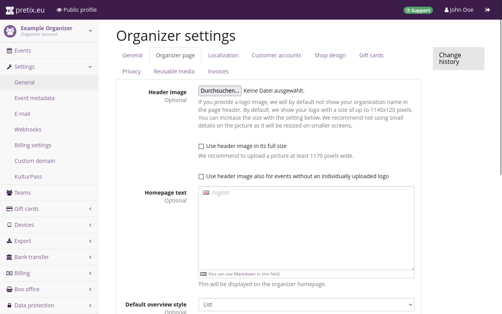

# Organizer account

An organizer account represents an entity that is running events, for example a company, an institution, or a person. 
We just created an organizer account when we created your personal account. 
It is also possible to gain (partial) access to an organizer account by being invited to pretix by a team member and accepting that invitation. 

In this section of the tutorial, we will customize our organizer account and add necessary information to it. 
This entails: 

 - navigating to the organizer account settings 
 - adding contact information on the "general" tab
 - choosing language and localization options on the "localization" tab 
 - customizing your organizer page on the "organizer page" and "shop design" tabs
 - enabling customer accounts for certain features on the "customer accounts" tab
 - setting up cookie/privacy information on the "privacy" tab 
 - getting our pretix account activated by providing necessary information in the "billing settings"

Those are the necessary steps for getting our organizer account up and running so that we can use it to host events using pretix. 
It also includes a few optional steps that will save us some work in the long run. 
For instance, organizer-level language and design settings will be used as the default for any events we are going to create in the future. 
We can always come back to the organizer account settings later and adapt them, should our needs change. 

## Navigating to the organizer account settings 

After finishing account creation and logging in to [pretix.eu/control](https://pretix.eu/control/), we are greeted by the dashboard. 
We will click the :btn:Organizers: button in the sidebar to get to the Organizers page. 

 

Clicking our organizer account in the list takes us to a page displaying all events associated with that organizer. 

 

We are going to click :btn:Settings: in the sidebar to set up our organizer account. 
This lands us on the general settings page for the organizer account. 

## General 

 

The fields for "name" and "short form" are already filled out. 
It is not possible to change the short form since it is the organizer's unique identifier. 

Since we are operating from Germany, we are going to enter the URL to our website's imprint in the "Imprint URL" field. 

We will enter a valid email address into the "contact address" field. 
This email address will be displayed publicly to allow your customers to contact you. 

We will then confirm our changes by clicking the :btn:Save: button on the bottom of the page. 

## Localization 

 

After saving the general settings, we are going to switch to the "localization" tab. 
We are going to finalize our localization settings __before__ changing any settings on the "organizer page" tab because the localization settings determine which customizations are available there. 

Under "available languages", we can choose which languages your ticket shop will be published in. 
The options officially maintained by the pretix team are English, German, and German (informal). 
German uses "Sie" to address the user whereas German (informal) uses "du". 
We can also choose one of the community translations for our organizer page. 
They are displayed in the list below along with a percentage of how much of the software is translated. 
English is used as the fallback language for missing translations. 
These settings also determine the default languages when creating new events, though languages can be activated or deactivated for each event individually.
We are going to activate English and German (informal) for our example conference. 



We are going to choose Germany from the drop-down "region" menu. 
The selection will be used to determine default date, time, address and phone number formatting. 
The language chosen above will take a higher priority than the region. 
We will choose "Europe/Berlin" as the "default timezone" from the drop-down menu with that title. 

## Organizer page 

 

Switching to the "organizer page" tab at the top allows us to add images to our event shop and customize its colors.
Clicking the :btn:👁 Public profile: button in the bar at the top takes us to a preview of the organizer page from the customers' perspective.
An organizer page created with pretix Hosted will always be located at https://pretix.eu/[OrganizerShortForm]/.
The shop we are creating for this tutorial is located at [https://pretix.eu/ex-org/](https://pretix.eu/ex-org).

By default, the name of the organizer will be displayed in the page header of our page.
The organizer page settings allow us to replace the name with a header image that tells our customers who is hosting the event (e.g., by means of your company name, logo, or recognizable design). 
We are going to add the header image by clicking the :btn:Browse...: button next to the "Header image" option and choosing a .png file with a resolution of 1140 × 120 pixels from our computer. 
The header image will replace the name of the event at the top of the page.
We are going to check the box next to "Use header image also for events without an individually uploaded logo". 

 

In the "homepage text" fields, we can provide text to be displayed on our public profile. 
There is one field for each language we activated in the "localization" tab (see the "localization" segment of this article)—English and German (informal). 
Our public profile will allow the viewer to switch between those languages via the links in the top right corner. 

## Shop design 

 

Switch to the "shop design" tab. 
Here, you can customize the colors and font used for your public profile and the ticket shops you are going to create. 
You can change the colors so that they're in line with the palette you use for your other media. 
Please heed the notice underneath the input fields and pick a different color if contrast is too low. 

You can also choose your preferred font from the list. 
If you're creating a ticket shop in a language that doesn't use the Latin alphabet, you should choose a font that supports the writing system you need. 
All available fonts support the Latin alphabet. 
The preview should give you an idea which writing systems each font supports. 
So for example, if you're creating a ticket shop in a language that uses the Cyrillic alphabet, you should pick a font such as DejaVu Sans or Noto Sans. 

The shop design you set here will be the default for all shops you create for your events in the future. 
You can make individual adjustments to the event shops. 

## Privacy 

 

On the "privacy" tab, please provide an URL pointing to your privacy policy for each language you activated. 
The default dialog text and button labels for the cookie consent banner should already be filled out. 
Feel free to edit or replace these as you see fit. 

pretix itself only ever sets cookies that are required to provide the service requested by the user or to maintain an appropriate level of security. 
Therefore, cookies set by pretix itself do not require consent in all jurisdictions that we are aware of. 
The settings on the "privacy" tab will only have an effect if you use plugins that require additional cookies and participate in our cookie consent mechanism.

Ultimately, it is your responsibility to make sure you comply with all relevant laws. 
We try to help by providing these settings, but we cannot assume liability since we do not know the exact configuration of your pretix usage, the legal details in your specific jurisdiction, or the agreements you have with third parties such as payment or tracking providers.

## Activation

Before any of your ticket shops can go live, your organizer account has to be activated. 
Your account is reviewed manually by our team as soon as you have provided all necessary information for correspondence and billing.

Navigate to [Your Organizer]→"Settings"→"Billing settings". 
The topmost field on the "general" tab is labeled "primary contact person". 
Enter the name of a real person (e.g. you or a coworker) we can contact if there is an issue with your account. 
Enter their email address and phone number in the fields below.

Enter the full contact details of your company further down on the page. 
If your company is located in the EU but outside of Germany, we recommend entering a VAT ID. 
If you do not provide your VAT ID here, we will need to charge you VAT on our services and we will not be able to issue reverse charge invoices. 
Again, this only applies if your company is located in the EU but outside of Germany. 

You can choose a preferred language of correspondence. 
We offer service in English and German.

Choose your preferred method of payment. 
You may pay by SEPA direct debit, by invoice, or by credit card. 
If you want to pay by SEPA direct debit, fill out your bank details in the form below and approve the mandate. 
If you want to pay by credit card, fill out your credit card information and authorize credit card payments to rami.io GmbH. 
If you are planning on only offering free tickets, you don't have to provide any further information here.

Once you are happy with your choices, click the :btn:Save: button. 
The page will notify you if any required information is still missing. 
If you have provided all required information, a green checkmark will appear at the top of the page with the message "Your changes have been saved." This means that your organizer account has been submitted to our team for review and will be activated shortly.

The "billing contact" and "privacy contact" tabs allow you to provide different contacts within your organization for billing and privacy matters. 
This is completely optional. 
You only need to fill out the information on the "general" tab of the billing settings to get your account approved. 