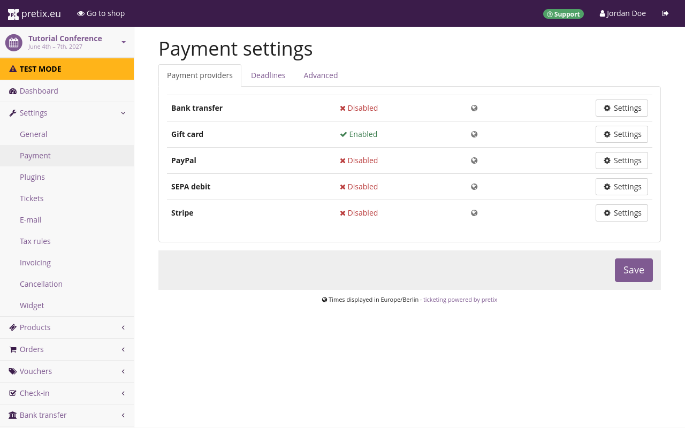
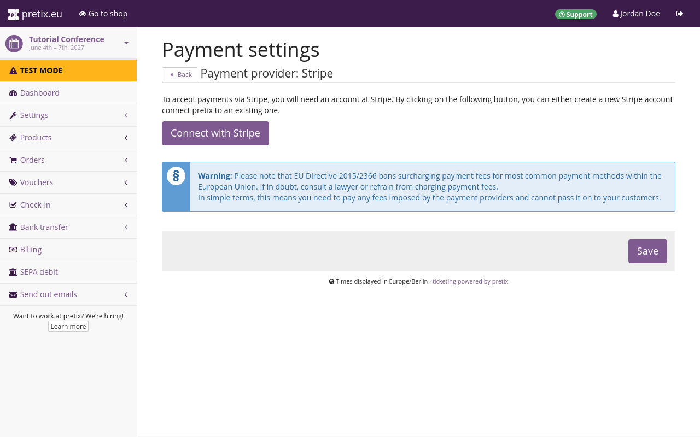
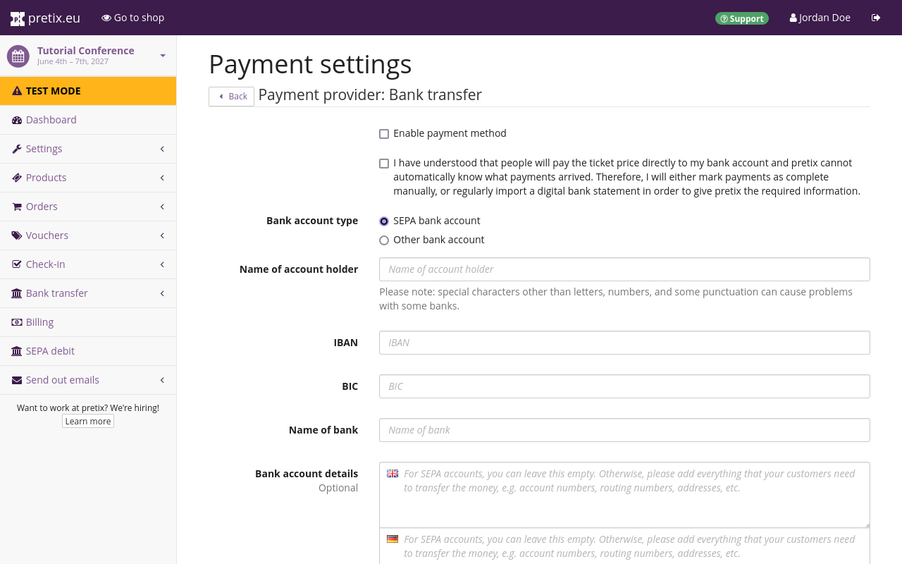
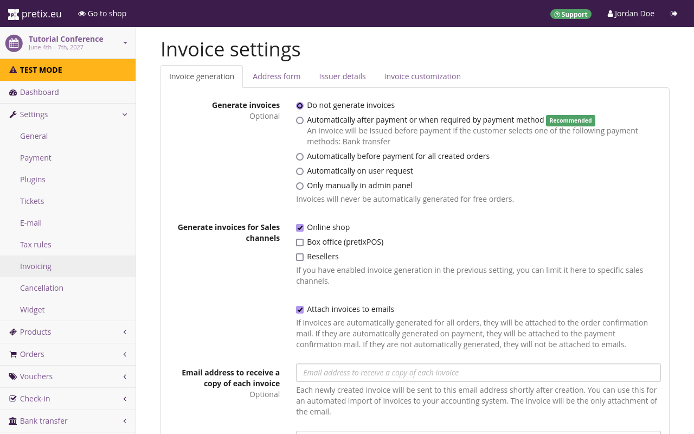

# Payment

We do not just want to offer tickets in our shop; we also want to get paid for them. 
That is what we will take care of in this part of the tutorial. 
We will set up payment via bank transfer and credit card. 
We will also set up invoices to be sent automatically with every order. 

## Setting up payment providers 

pretix takes care of payment via a wide selection of payment providers. 
For our conference, we are planning to receive payments by credit card through the payment provider Stripe and by bank transfer. 
The prerequisites for this are an active Stripe merchant account and a bank account. 
pretix will automatically log payments coming in through most payment providers, including Stripe. 
An order in our shop is marked as paid as soon as Stripe records a corresponding payment. 
Bank transfers are the exception to that rule because the pretix software would need to monitor payments arriving at our bank account.
A connection to your bank account is possible to set up on pretix Hosted, but it is also possible to manually approve payments as they come in, or by regularly importing digital bank statements. 

 

In order to set up payment providers, we will navigate to our personal dashboard by clicking "pretix.eu" in the top left corner of the website. 
We will then select our event in the list of "Your upcoming events", open ":fontawesome-solid-wrench: Settings" in the sidebar and click the "Payment" subentry. 
This page displays a list of payment providers. 
Bank transfer and Stripe should be included in this list. 
By default, all payment providers in this list except gift card will be disabled. 

!!! Note 
    If the payment providers you want to use are not being displayed in this list, that means the corresponding plugin is not enabled. 
    In order to activate such a plugin, you have to navigate to [Your Event] :fontawesome-solid-arrow-right: "Settings" :fontawesome-solid-arrow-right: "Plugins" and open the "Payment providers" tab. 
    Click the :btn:Enable: button next to the plugin you want to use. 
    You can tell that a plugin has been activated by green ":material-check: Active" tag. 

### Stripe

 

We will first enable Stripe by clicking the :btn-icon:fontawesome-solid-gear:Settings: button next to it. 
This takes us to the payment settings page for Stripe, which currently only contains a :btn:Connect with Stripe: button. 

Clicking that button takes us to a dialog on stripe.com, where we will input our email address and go through the process of connecting our Stripe merchant account to our pretix account. 

We will then return to pretix.eu, navigate to our event, open ":fontawesome-solid-wrench: Settings" in the sidebar, click the "Payment" subentry and open the Stripe settings. 
Instead of the single button, the page will now display a multitude of settings. 
We will check the boxes next to "credit card payments" and "enable payment method", then scroll to the bottom and click the :btn:Save: button. 
Credit card payments via Stripe are now available as a payment method for customers in our shop. 

### Bank transfers 

 

We will also enable bank transfers by navigating back to the payment page for our event [Event] :fontawesome-solid-arrow-right: "Settings" :fontawesome-solid-arrow-right: "Payment" and opening the bank transfer settings. 
We are going to choose "SEPA bank account" as our "bank account type". 
We will provide our bank account info, i.e. the name of the account holder, IBAN, BIC and the name of the bank in the fields labeled as such. 
We will then check the box to confirm that we have understood the special conditions that apply to bank transfers as a payment provider in pretix and the box next to "enable payment method". 
Then, we will click the :btn:Save: button and return to the payment settings. 
Bank transfer, gift card, and Stripe should all have a green ":material-check: Enabled" tag next to them now. 

!!! Note 
    By default, the pretix software is not able to monitor payments arriving at your bank account.
    On pretix Hosted, you can set up automated bank imports.
    On pretix Community and pretix Enterprise, you have to notify the pretix software of incoming payments—either by manually approving payments as complete, or by regularly importing digital bank statements. 
    Read our guide on [monitoring incoming payments](../topics/payment/bank-transfer.md#monitoring-incoming-payments) before using bank transfer as a payment method in your shop. 

For more information on using bank transfers, see [bank transfers](../topics/payment/bank-transfer.md). 

## Setting up invoices 

 

We will browse to the invoicing settings by navigating to our event, opening ":fontawesome-solid-wrench: Settings" in the sidebar and clicking the "Invoicing" subentry. 
On the "invoice generation" tab, we will set the "generate invoices" option to "automatically after payment or when required by payment method."
We will then switch to the "issuer details" tab and provide the name and full address of our organization. 
The data we enter here will be used for all invoices we generate from this point on. 
If we now click the :btn:Save and show preview: button, our browser is going to download a PDF preview of the invoice with our organization's address, the invoice number TUTCON27-PREVIEW and an example listing of purchases with a partially received payment. 

## Conclusion

Now that we have given our customers two options for making payments in our shop and set up the automatic dispatching of invoices, we can move on to testing our shop before finally taking it live. 
