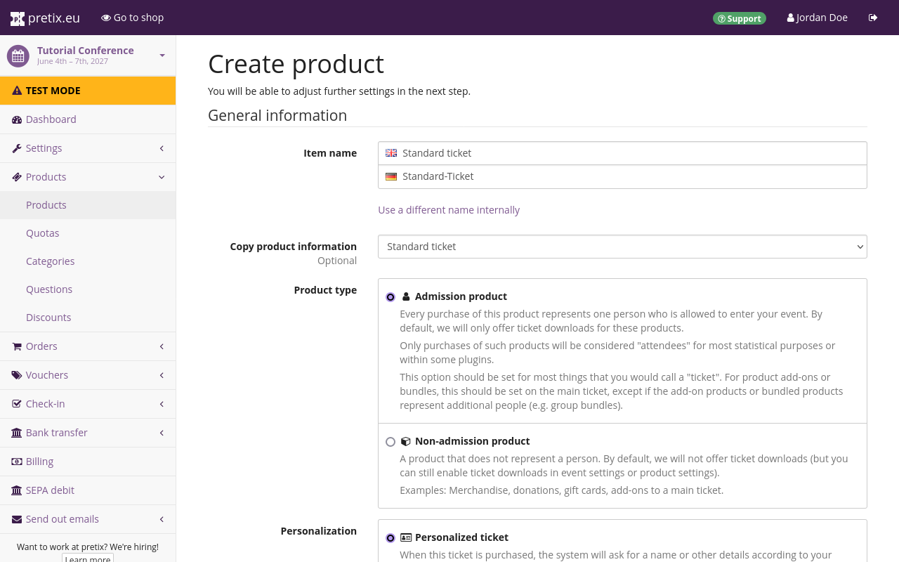
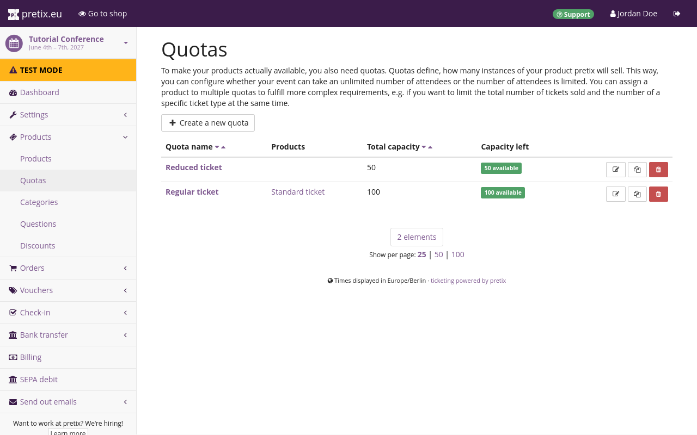

# Products

A product is anything sold via pretix: tickets, gift cards, conference t-shirts and so on. 
We will be selling a variety of products in our shop. 
In this article, we will cover the process of creating the following products and making them available in our shop: 

 - a basic [admission ticket](products.md#creating-and-editing-products)
 - a [discount ticket](products.md#discount-ticket) for students and members
 - a free [speaker ticket](products.md#speaker-ticket) that can only be purchased with a voucher
 - [stickers](products.md#product-with-variants) that come in three variants with different prices 

We are going to start by [creating categories](products.md#creating-and-editing-categories) to sort our products into, then we will create the products themselves, and lastly, we are going to [create quotas](products.md#creating-and-editing-quotas) to determine and keep track of availability numbers for each product. 

## Creating and editing categories

 

Categories can help us group products into sensible categories both in the backend and in our shop. 
They also separate standalone products from additional products. 
We are not only going to sell admission tickets in our shop, but also extras such as stickers. 
That means our next step is to create a category for those extras. 

For that, we will navigate to our personal dashboard by clicking :btn-icon:i-pretix: pretix.eu: in the top left corner of the website. 
We will then select our event in the list of "Your upcoming events", open :btn-icon:fa3-ticket: Products: in the sidebar and click the :btn:Categories: subentry. 
This page shows the list of all product categories, which at the moment should only include a single category named "Tickets". 

We will click the :btn-icon:fa3-plus: Create a new category: button and give the category a name such as "Extras". 
Clicking the :btn:Save: button at the bottom of the page takes us back to the product categories page, which now lists two entries: "Tickets" and our newly created category named "Extras". 

## Creating and editing products

 

Now that we have prepared the necessary categories for our products, we can set about editing the existing products and creating new ones to suit our needs. 

First, we will edit the "Regular ticket" so that we can base all other tickets on this one. 
In order to do that, we will navigate to :navpath:Event → :fa3-ticket: Products → Products:. 
The website should display two tickets that have already been created along with the event: "Regular ticket" and "Reduced ticket". 
We will click "Regular ticket", which takes us to the "Modify product" dialog. 

We will change the English item name to "Standard Ticket" and provide a German translation. 
We are going to add the following description: 
"Regular ticket granting access to the entire conference." 
Next, we will click on the :btn:Price: tab and change the "Default price" to €250.00. 
We will also select the appropriate tax rate of 19% from the "Sales tax" dropdown. 

Once we have done that, we are going to click the :btn:Save: button. 

### Discount ticket

 

We will now create the discount ticket based on the "Standard ticket" we just edited. 
There are two advantages to  this approach: First, we do not have to repeat all the same steps, and second, we are reducing our risk of forgetting any of them. 
The "Reduced ticket" is not needed anymore. 
We will navigate to the products page, click the red :btn-icon:fa3-trash:: delete button next to the reduced ticket, and confirm that we want to delete it. 

Back on the product overview, we will click the :btn-icon:fa3-copy:: clone button next to the standard ticket in order to clone it. 
We will name the new ticket "Discount ticket", provide a translation, change the "Default price" to €120.00, and click the :btn:Save: button. 

!!! Note 
    A warning is now displayed in a yellow box at the top of the page, saying: 
    "Please note that your product will not be available for sale until you have added your item to an existing or newly created quota." 
    This warning will also appear during the creation of subsequent products. 
    **We can safely ignore it** for now because we will take care of adding products to quotas in the very next section of this article. 
    That will make the warning disappear. 

On the next page, we have to adjust the "Description" field to inform our customers of the prerequisites for access to the discounted ticket. 
Our description reads:
"This ticket is only valid if you provide a student ID or member ID at check-in."

We will then switch to the :btn:Price: tab, change the "Default price" to €120.00 and the original price to the price of the standard ticket, i.e. €250.00. 
The original price will be displayed as struck-through and the new default price will be displayed in bold green, highlighting the discount price. 

Then, we will go to the :btn:Check-in and validity: tab and check the box next to "Requires special attention". 
We have to provide instructions for the person operating the check-in at our event in the "Check-in text" field. 
Our instructions say: "Check for student ID/member ID". 
We will then click the :btn:Save: button. 

### Speaker ticket

Next, we are going to create a speaker ticket that is free, but can only be purchased with a voucher. 
For that, we will navigate back to the products page :navpath:Event → Products → Products: and click the :btn-icon:fa3-copy:: clone button next to the standard ticket in order to clone it. 
We will name the new ticket "Speaker ticket", provide a translation, and change the "Default price" to €0.00, leave the other options on this page unchanged and click the :btn:Save and continue with more settings: button. 

We will switch to the :btn:Availability: tab and check the box next to the option "This product can only be bought using a voucher" about halfway down the page. 
There is a toggle next to that option with an eye and an information symbol: :btn-icon:fa3-eye-slash:: :btn-icon:fa3-info::. 
We are going to set that toggle to :btn-icon:fa3-eye-slash:: with the tooltip "Hide product if unavailable". 
This means that the ticket will only be displayed to people who hold a corresponding voucher in our shop. 
Once we have set the checkbox and toggle, we will click the :btn:Save: button. 

Our plan is to send voucher codes to our invited speakers which will grant them access to this specialized type of ticket. 
For more information on vouchers, see [vouchers](../guides/vouchers.md). 

### Product with variants

 

After having created all the admission products we need, we will now create a sticker product with multiple variants: purple, black, and glitter. 
It is not possible to edit a product without variations into a product with multiple variations. 
Therefore, we will navigate to the products page and click the :btn-icon:fa3-plus: Create a new product: button. 

We will name the product "Sticker", set it to "Non-admission product" and put it in the "Extras" category. 
Under "Product variations", we will select "Product with multiple variations". 
We will set the default price to €5.00. 
Then, we will click :btn:Save and continue with more settings:. 

Next, we will click on the :btn:Variations: tab. 
This tab will only be displayed if we selected "Product with multiple variations" during the creation of the product. 
There should be one variant called "Standard" here. 
We will click the name to expand the settings for that variant and change the name to "Purple". 
It is not necessary to change any other settings here. 

Then, we will scroll down and click the :btn-icon:fa3-plus: Add a new variation: button. 
We will name this new variant "Black" and keep the other settings the way they are. 
We will repeat the same process for the "Glitter" variant and set the "Default price" option for that variant to €7.50. 
Then, we will click :btn:Save:. 

## Creating and editing quotas 

A quota determines how many instances of our product can be sold. 
Every product has to be part of at least one quota before it becomes available in the shop.
In this section, we are going to create quotas and add our products to them. 

We will navigate to :navpath:Event → :fa3-ticket: Products → Quotas:. 
This page shows the list of all quotas for the event, which at the moment includes the "Regular ticket" quota, containing the standard ticket as a product, and the "Reduced ticket" quota, not containing any ticket. 
The list also displays the total capacity and how many items are left for each quota. 

### Quotas for tickets 

 

First, we will edit a quota for our standard and discount tickets. 
It makes sense to include both tickets in a single quota because we cannot plan ahead how many of the tickets we sell are going to be discount tickets. 
We will click the :btn-icon:fa3-edit:: change button next to the "Regular ticket" quota in the list. 
We are also going to rename this quota to "Standard and discount ticket" to avoid confusion. 
The "Standard ticket" should already be checked in the list of products. 

We will also check the "Discount ticket" in the list and change the capacity to 1900 because that is the maximum amount of tickets of these types that we want to sell. 
Our venue has room for 2000 people, 100 of which are going to be speakers. 
We will leave the rest of the settings unchanged and click the :btn:Save: button. 
This takes us to a detailed overview of the status of the "Standard ticket" quota. 

Since both the standard and discount tickets are covered by the same quota now, the "Reduced ticket" quota is not needed anymore. 
We will navigate back to the quotas page and click the :btn-icon:fa3-trash:: delete button next to the "Reduced ticket" quota. 

Our speaker ticket needs to be assigned to a quota, too. 
We will now navigate to the quotas page again and click the :btn-icon:fa3-plus: Create a new quota: button. 
We will name the new quota "Speaker ticket" and set its number to 100 because that is the expected number of speakers at our event. 
In the list of products, we will check the box next to "Speaker ticket". 

### Quotas for variants 

Our sticker product needs three different quotas: one for each product variant. 
We will navigate back to the quotas page and click the :btn-icon:fa3-plus: Create a new quota: button. 
We will call the new quota "Sticker purple" and set the total capacity to 100 because that is the number of stickers in that color that we're going to sell. 

Then, we will select "Sticker - Purple" in the list of products. 
The purple sticker is not an admission ticket but an additional product that can be purchased in the same shop. 
We do not want this quota to add to the total number of tickets available for the event. 
Thus, we are going to check the box next to "Ignore this quota when determining event availability" before clicking the :btn:Save: button. 

Since we still need quotas for the other variants of the product, we will navigate back to the quotas page and click the :btn-icon:fa3-copy:: clone button next to the sticker quota we just created. 
We will name the new quota "Sticker Black", unselect "Sticker - Purple" from the list of products and select "Sticker - Black" instead. 
Finally, we will click :btn:Save: and repeat the same process for the glitter color, adjusting the total capacity as needed. 

If we now navigate back to the "Products" page, open the "Sticker" product and click on the :btn:Variations: tab, there should be no more yellow boxes warning us that we need to add the product and variants to a quota before they can be sold. 

## Conclusion 

We have created all the tickets and other products that we are planning to sell in our shop, sorted them into categories, and added them to quotas. 
We can now move on to [setting up payment methods](payment.md) that our customers can use to purchase these products. 
