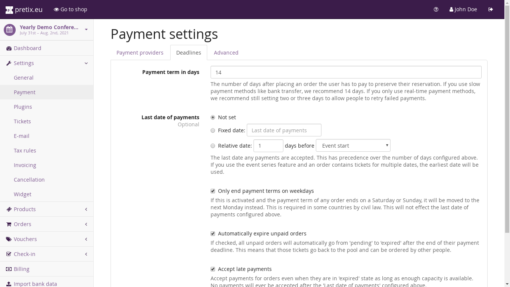

General settings
================

At "Settings" → "Payment", you can configure every aspect related to the payments you want to accept. The "Deadline"
and "Advanced" tabs of the page show a number of general settings that affect all payment methods:

In particular, these are:

Payment term in days
  If a order has been created, it is supposed to be paid within this number of days. Of course, some payment methods
  (like credit card) succeed immediately in most cases, but others don't (like bank transfer) and even credit card
  payments might fail and you might want to give the customer a chance to try another credit card before losing their
  ticket. Therefore, we recommend setting a few days here. If you are accepting bank transfers, we wouldn't recommend
  less than 10 days.

Last date of payments
  There is probably no use for payments received after your event, so you can set a date that the payment deadline of
  a new order will never exceed. This has precedence over the number of days configured above, so if I create an order
  two days before the configured last date of payments, my payment term will only be two days, not ten. If you have
  payment methods that always require some time (like bank transfer), you will later be able to selectively disable them
  once the event comes closer.

Only end payment terms on weekdays
  If you check this box, the payment term calculated by the number of days configured above will never end on a Saturday
  or a Sunday. If it technically would do so, the term is extended to the next Monday. Note that this currently does not
  take into account national or bank holidays in your country.

Automatically expire unpaid orders
  If you check this box, orders will automatically go into "expired" state if the payment term is over and no payment
  has been received. This means that the tickets will no longer be reserved for the customer and someone else can buy
  them from the shop again. If you do not check this box, tickets do not become available again automatically, but you
  can mark orders as expired manually.

Accept late payments
  If you check this box, incoming payments will accepted even if the order is in "expired" state -- as long as there
  still is sufficient quota available and the last date of payments is not yet over. We recommend to check this in most
  cases.

Tax rule for payment fees
  If you pass on the payment method fees to your customers, you will most likely also need to pay sales tax on those
  fees. Here, you can configure the tax rate. Read Taxes for more information.

Below, you can configure the details of the various payment methods. You can find information on their different settings
on the next pages of this documentation, but there are a few things most of them have in common:

Enable payment method
  Check this box to allow customers to use this method. At least one method needs to be active to process non-free orders.

Additional fee (absolute and percentage), Calculate the fee from the total value including the fee
  These fields allow you to pass fees on to your customers instead of paying them yourselves. Read payment fees
  for documentation on how this behaves.

Available until
  This allows you to set a date at which this payment method will automatically become disabled. This is useful if you
  want people to be able to pay by card on the day before your event, but not by bank transfer, because it would not
  arrive in time.

Text on invoices
  If you are using pretix' invoicing feature, this is a text that will be printed on every invoice for an order that
  uses this payment method. You could use this to tell the accounting department of the invoice receiver that the payment
  has already been received online or that it should be performed via bank transfer.
