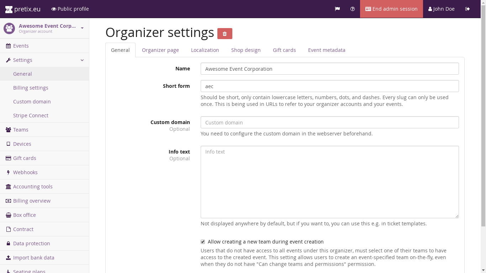

# Using a custom domain

By default, event shops built with pretix are accessible at ``https://<domain>/<organizer>/<event>/``, where
``<domain>`` is ``pretix.eu`` if you are using our hosted service and ``<organizer>`` and ``<event>`` are the short
form versions of your organizer account name and event name, respectively.

However, you are also able to use a custom domain for your ticket shops! If you work for "Awesome Party Corporation"
and your website is ``awesomepartycorp.com``, you might want to sell your tickets at ``tickets.awesomepartycorp.com``
and with pretix, you can do this. On this page, you find out the necessary steps to take.

## With the pretix.eu hosted service

Go to "Organizers" in the backend and select your organizer account. Then, go to "Settings" and "Custom Domain".

This page will show you instructions on how to set up your own domain. Basically, it works like this:

Go to the website of the provider you registered your domain name with. Look for the "DNS" settings page in their
interface. Unfortunately, we can't tell you exactly how that is named and how it looks, since it is different for every
domain provider.

Use this interface to add a new subdomain record, e.g. ``tickets`` of the type ``CNAME`` (might also be called "alias").
The value of the record should be the one shown on the "Custom Domain" page in pretix' backend.

Submit your changes and wait a bit, it can regularly take up to three hours for DNS changes to propagate to the caches
of all DNS servers. You can try checking by accessing your new subdomain, ``http://tickets.awesomepartycorp.com``.
If DNS was changed successfully, you should see a SSL certificate error. If you ignore the error and access the page
anyways, you should get a pretix-themed error page with the headline "Unknown domain".

Now, tell us about your domain on the "Custom Domain" page to get started.

## With a custom pretix installation

If you installed pretix on a server yourself, you can also use separate domains for separate organizers.
First of all, configure your webserver or reverse proxy to pass requests to the new domain to pretix as well.
Then, go to the organizer account in pretix and click the "Edit" button. Enter the new domain in the "Custom Domain"
field, then you're done!

Note that this field only shows up if you are logged in as a system administrator of your pretix installation.
