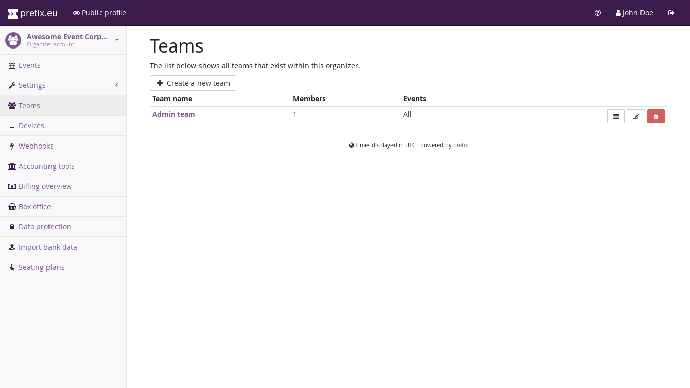
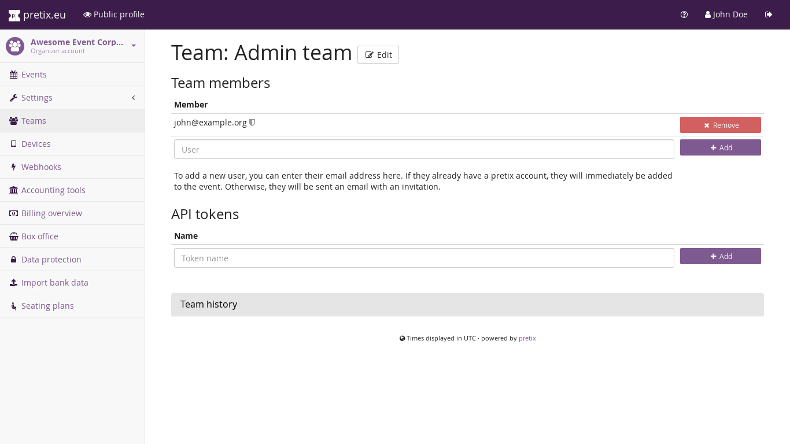
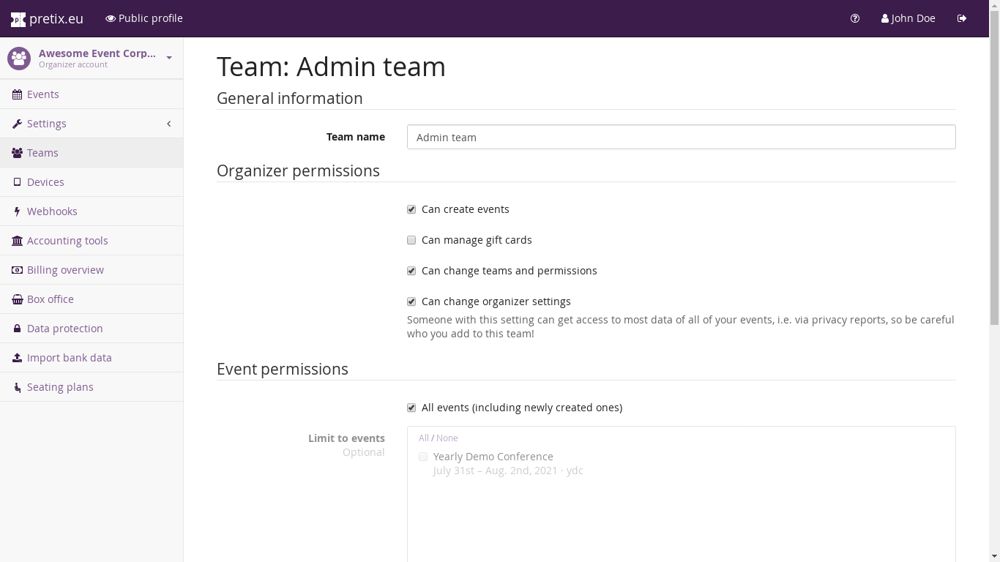

# Teams

We don't expect you to work on your events all by yourself and therefore, pretix comes with ways to invite your fellow
team members to access your pretix organizer account. To manage teams, click on the "Teams" link on your organizer
settings page (see above how to find it). This shows you a list of teams that should contain at least one team already:

If you click on a team name, you get to a page that shows you the current members of the team:

You see that there is a list of pretix user accounts (i.e. email addresses), who are part of the team. To add a user to
the team, just enter their email address in the text box next to the "Add" button. If the user already has an account
in the pretix system they will instantly get access to the team. Otherwise, they will be sent an email with an invitation
link that can be used to create an account. This account will then instantly have access to the team. Users can be part
of as many teams as you want.

In the section below, you can also create access tokens for our :ref:`rest-api`. You can read more on this topic in the
section :ref:`rest-auth` of the API documentation.

Next to the team name, you again see a button called "Edit" that allows you to modify the permissions of the team.
Permissions separate into two areas:

**Organizer permissions** allow actions on the level of an organizer account, in particular:

   * Can create events – To create a new event under this organizer account, users need to have this permission
   * Can manage customer accounts – This permission is required to view and change organizer-level customer accounts.
   * Can change teams and permissions – This permission is required to perform the kind of action you are doing right now.
     Anyone with this permission can assign arbitrary other permissions to themselves, so this is the most powerful
     permission there is to give.
   * Can change organizer settings – This permission is required to perform changes to the settings of the organizer
     account, e.g. its name or display settings.

**Event permissions** allow actions on the level of an event. You can give the team access to all events of the
  organizer (including future ones that are not yet created) or just a selected set of events. The specific permissions to choose from are:

   * Can change event settings – This permission gives access to most areas of the control panel that are not controlled
     by one of the other event permissions, especially those that are related to setting up and configuring the event.
   * Can change product settings – This permission allows to create and modify products and objects that are closely
     related to products, such as product categories, quotas, and questions.
   * Can view orders – This permission allows viewing the list of orders and all individual order details, but not
     changing anything about it. This also includes the various exports offered.
   * Can change orders – This permission allows all actions that involve changing an order, such as changing the products
     in an order, marking an order as paid or refunded, importing banking data, etc. This only works properly if the
     same users also have the "Can view orders" permission.
   * Can view vouchers – This permission allows viewing the list of vouchers including the voucher codes themselves and
     their redemption status.
   * Can perform check-ins – This permission allows using web-based features to perform ticket search and check-in.
   * Can change vouchers – This permission allows to create and modify vouchers in all their details. It only works
     properly if the same users also have the "Can view vouchers" permission.

